# Домашнее задание к занятию "`Система мониторинга Zabbix. Часть 2`" - `Дедюрин Денис`
---

## Задание 1

### Создаем свой шаблон, в котором будут элементы данных, мониторящие загрузку CPU и RAM хоста:
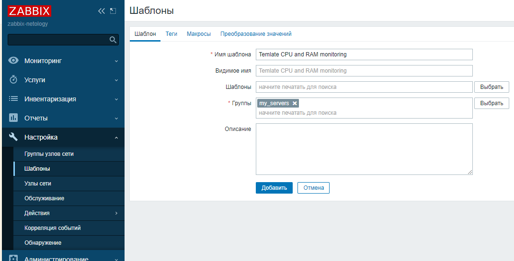

### Добавляем элемент данных CPU:
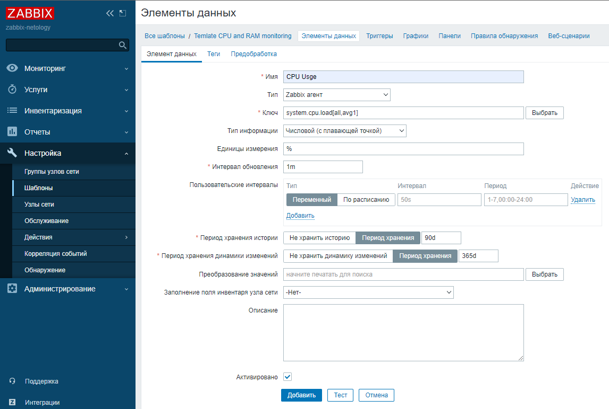

### Добавляем тэг (Resource Type: CPU):
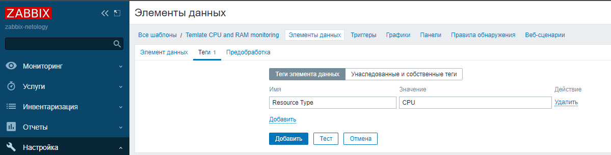

### Добавляем элемент данных RAM:
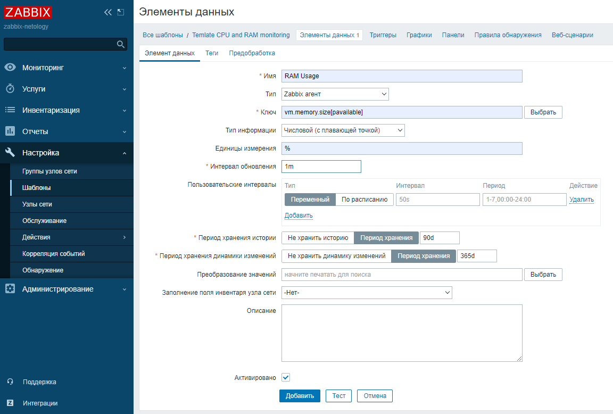

### Добавляем тэг (Resource Type: RAM):
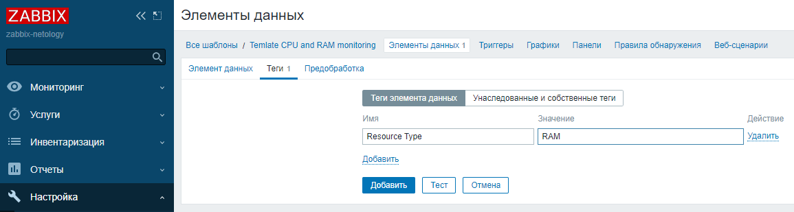

---

## Задание 2

### Добавляем созданные агенты и присоединяем к ним необходимые шаблоны:
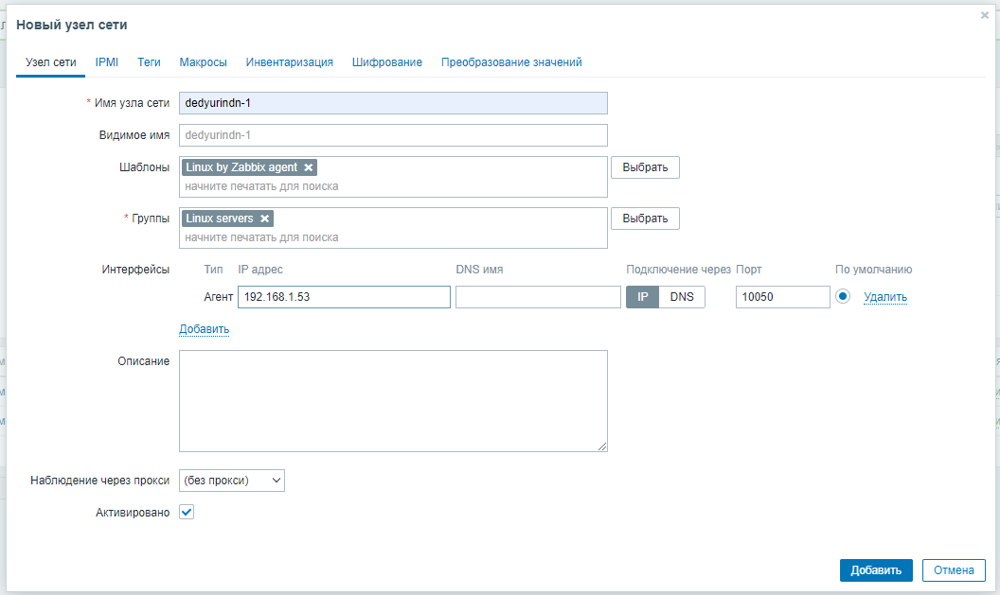
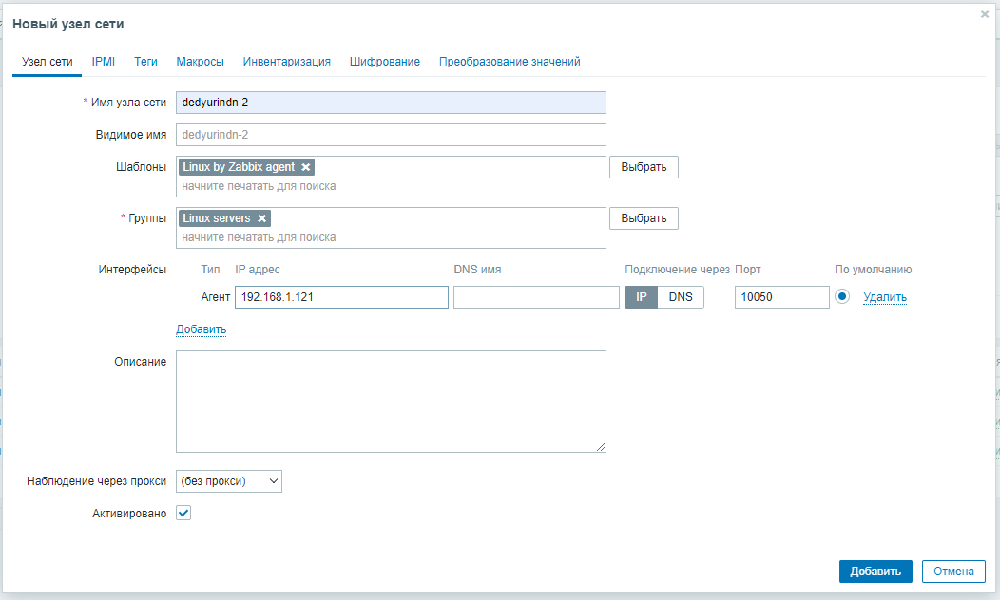
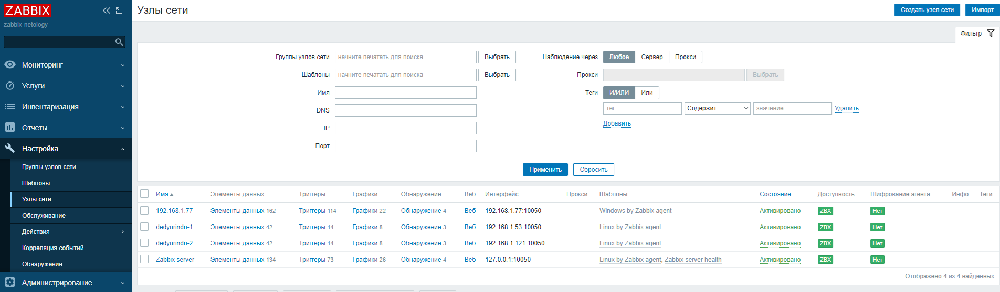

### Переходим в меню Latest Data, чтобы убедиться, что начали появляться данные с добавленных агентов:
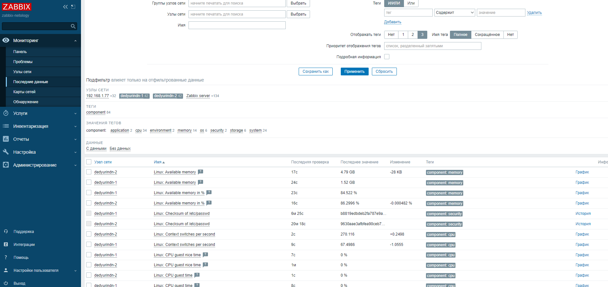

---

## Задание 3

### При попытке добавления созданного вручную шаблона к хосту у которого уже присоединен шаблон Linux by Zabbix agent и данный шаблон имеет такой же набор элементов данных, то присоединить свой шаблон мы не сможем, пока не осоединим существующий.
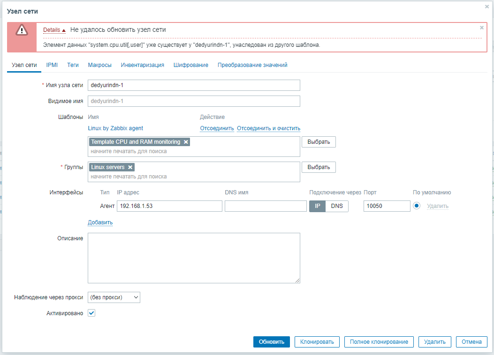

### Осоединяем шаблон Linux by Zabbix agent и добавляем свой.
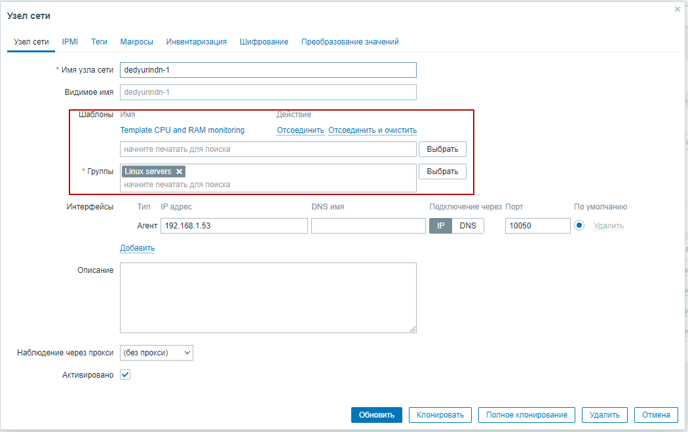

### Проделываем аналогичные операции со вторым хостом.

### Переходим в меню Latest Data, чтобы убедиться, что начали появляться данные после смены шаблонов у хостов:
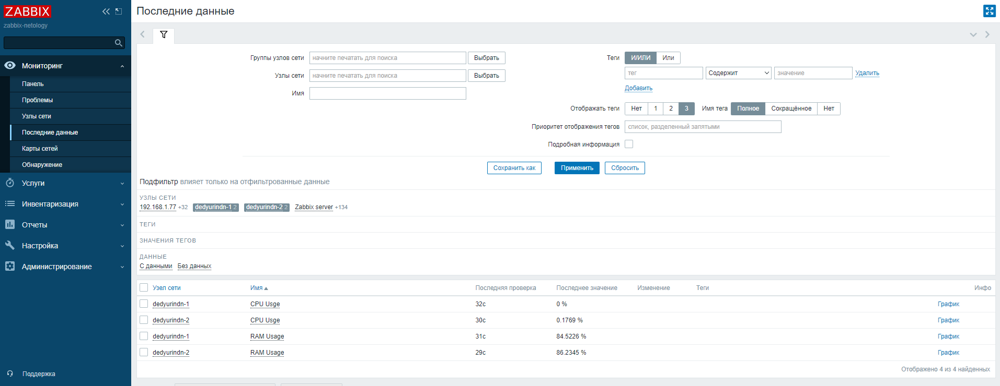

---

## Задание 4

### Создаем свой дашборд:
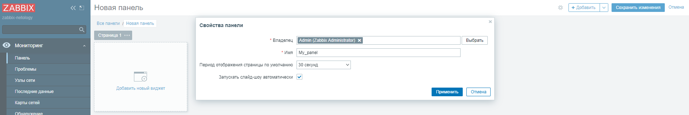

### Добавляем графики для 2 хостов:
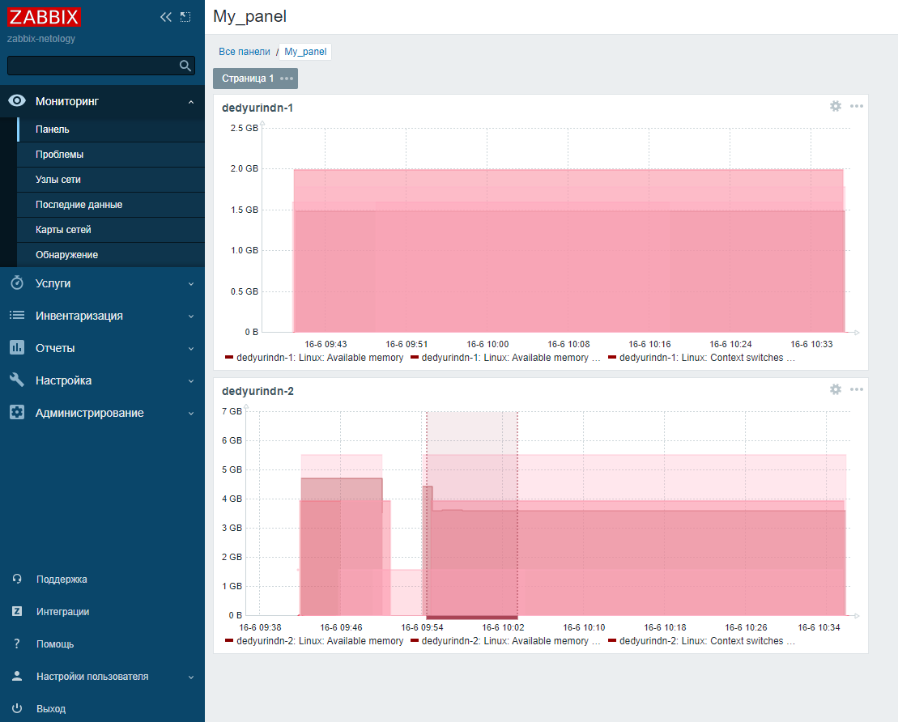

---

## Задание 5*

### Создаем новую карту:
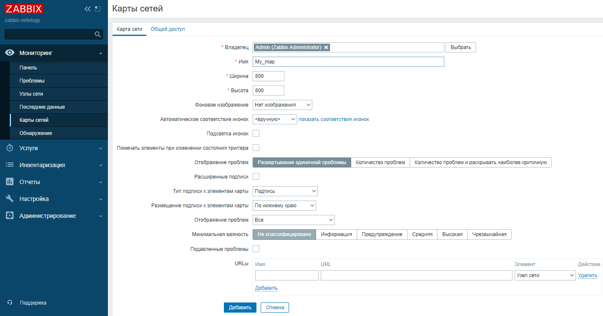

### Добавляем на карту наши созданные хосты:
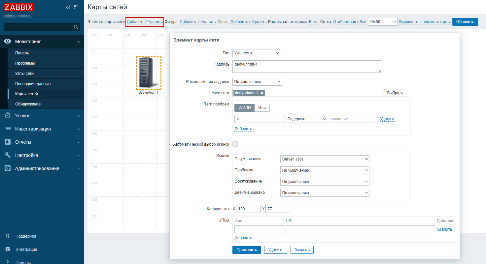

### Добавляем связь между хостами и самим Zabbix-server:
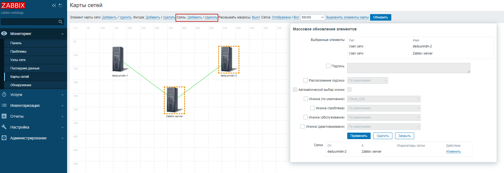

### Добавляем триггер на недоступность агента на хосте dedyurindn-1:
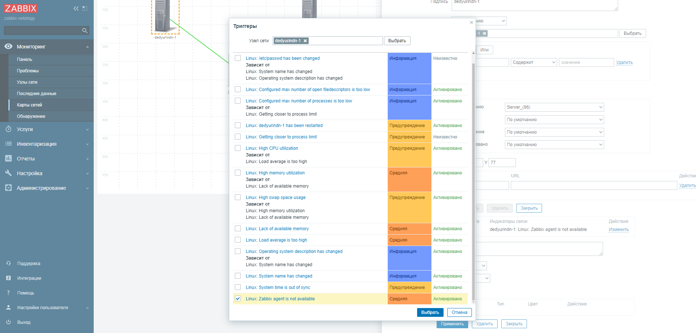

### Тоже самое проделываем на хосте dedyurindn-2:
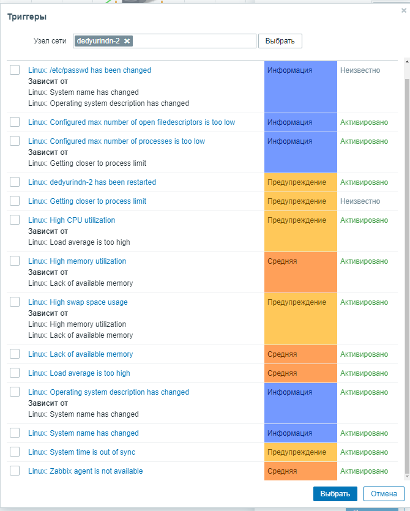

### Сохраняем и получаем итоговую карту:
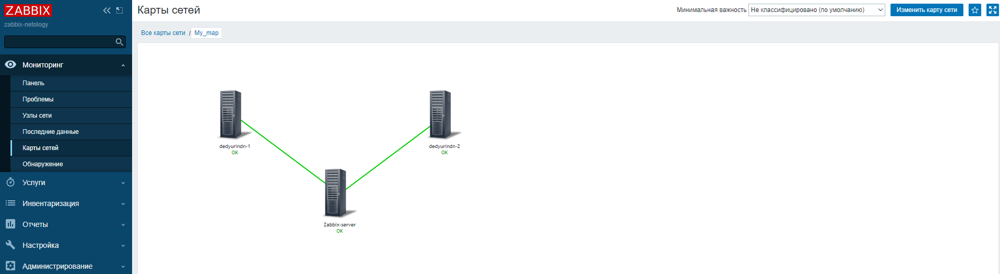

### Для проверки останавливаем агенты на обоих хостах и дожидаемся чтобы сработал триггер:

```
systemctl stop zabbix-agent
```

### В итоге видим, что свзи между сервером и хостами стали крсаного цвета:
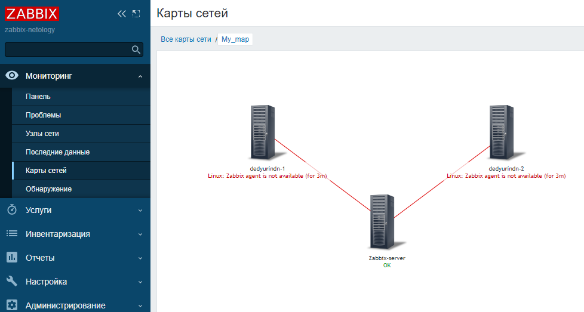


